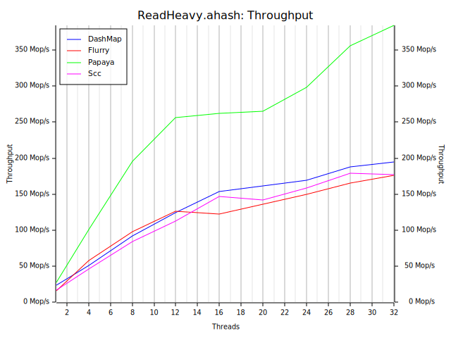
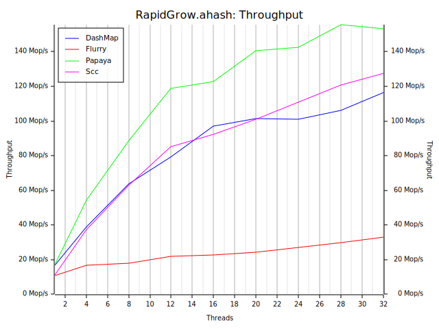
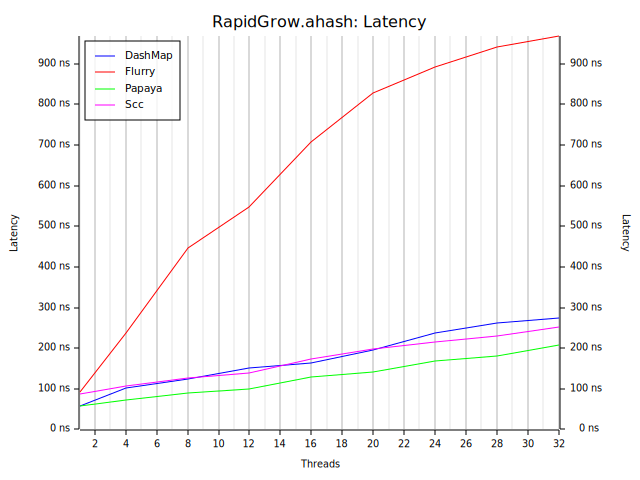

# Benchmarks

*As always, benchmarks should be taken with a grain of salt. Always measure for your workload.*

Below are the benchmark results from the [`conc-map-bench`](https://github.com/xacrimon/conc-map-bench) benchmarking harness under varying workloads. All benchmarks were run on a Ryzen 3700X (16 threads) with [`ahash`](https://github.com/tkaitchuck/aHash) and the [`mimalloc`](https://github.com/microsoft/mimalloc) allocator.

### Read Heavy

| | |
:-------------------------:|:-------------------------:
 | 

### Exchange

| | |
:-------------------------:|:-------------------------:
 | 

### Rapid Grow

| | |
:-------------------------:|:-------------------------:
 | 

# Discussion

`papaya` is read-heavy workloads and outperforms all competitors in the read-heavy benchmark. It falls short in update and write-heavy workloads due to allocator pressure, which is expected. However, an important guarantee of `papaya` is that reads *never* block under any circumstances. This is crucial for providing consistent read latency regardless of write concurrency.

Additionally, `papaya` does a lot better in terms of latency distribution due to incremental resizing and the lack of bucket locks. Comparing histograms of `insert` latency between `papaya` and `dashmap`, we see that `papaya` manages to keep tail latency orders of magnitude lower. Some tail latency is unavoidable due to the large allocations necessary to resize a hash-table, but the distribution is much more consistent (notice the scale of the y-axis).

