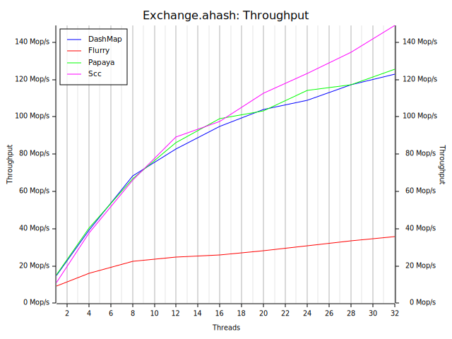

# Benchmarks

*As always, benchmarks should be taken with a grain of salt. Always measure for your workload.*

Below are the benchmark results from the [`conc-map-bench`](https://github.com/xacrimon/conc-map-bench) benchmarking harness under varying workloads. All benchmarks were run on a 16-core AMD EPYC processor, using [`ahash`](https://github.com/tkaitchuck/aHash) and the [`mimalloc`](https://github.com/microsoft/mimalloc) allocator.

### Read Heavy

| | |
:-------------------------:|:-------------------------:
 | 

### Exchange

| | |
:-------------------------:|:-------------------------:
 | 

### Rapid Grow

| | |
:-------------------------:|:-------------------------:
 | 

# Discussion

As mentioned in the [performance](../README#performance) section of the guide, `papaya` is optimized read-heavy workloads. As expected, it outperforms all competitors in the read-heavy benchmark. An important guarantee of `papaya` is that reads *never* block under any circumstances. This is crucial for providing consistent read latency regardless of write concurrency. However, it falls short in update and insert-heavy workloads due to allocator pressure and the overhead of memory reclamation, which is necessary for lock-free reads. If your workload is write-heavy and you do not benefit from any of `papaya`'s features, you may wish to consider an alternate hash-table implementation.

Additionally, `papaya` does a lot better in terms of latency distribution due to incremental resizing and the lack of bucket locks. Comparing histograms of `insert` latency between `papaya` and `dashmap`, we see that `papaya` manages to keep tail latency lower by a few orders of magnitude. Some latency spikes are unavoidable due to the allocations necessary to maintain a large hash-table, but the distribution is much more consistent (notice the scale of the y-axis).

